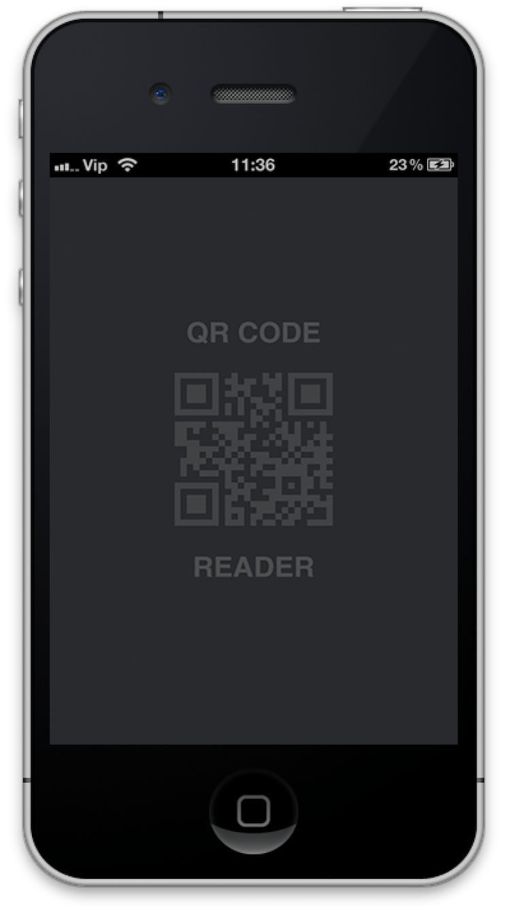

QRCodeReader
===========
## Screenshot

[](https://youtu.be/HEnNMDQ58HU)

## How to use
##### 1. Embeded Binaries
https://youtu.be/A7KhnHdOs6A

##### 2. Drag and drop UIView in your view controller.
##### 3. Change Class of UIVIew.
##### 4. Bind your UIView.
https://youtu.be/_iWtz7nWIaM


#### *Paste "M1, M2" methods in your view controller* (i.e. "ViewController.m")

#### "M1" *viewDidLoad*
```objective-c
- (void)viewDidLoad {
[super viewDidLoad];
// Do any additional setup after loading the view from its nib.
self.title = @"QR Code Reader";
[qrCodeView setDelegate:self];
[qrCodeView startReading];
}
```

##### And here the delegate methods:
### "M2" QRCodeReaderDelegate
```objective-c
#pragma mark - QRCodeReaderDelegate
- (void)getQRCodeData:(id)qRCodeData {
UIAlertController *alertController = [UIAlertController alertControllerWithTitle:@"QR Code" message:qRCodeData preferredStyle:UIAlertControllerStyleAlert];

UIAlertAction *cancel = [UIAlertAction actionWithTitle:@"Close" style:UIAlertActionStyleDefault handler:nil];
[alertController addAction:cancel];

UIAlertAction *reScan = [UIAlertAction actionWithTitle:@"Rescan" style:UIAlertActionStyleDefault handler:^(UIAlertAction * _Nonnull action) {
[qrCodeView startReading];
}];
[alertController addAction:reScan];
[self presentViewController:alertController animated:YES completion:nil];
}
```